# NofyAI - AI-Driven Algorithmic Trading System

<div align="center">

[](https://nextjs.org/)
[](https://reactjs.org/)
[](https://www.typescriptlang.org/)
[](LICENSE)

An AI-powered multi-agent algorithmic trading system supporting Aster DEX exchange.

**Languages:** [English](README.md) | [中文](README_zh.md)

[Features](#features) • [Quick Start](#quick-start) • [Architecture](#architecture) • [Configuration](#configuration) • [API Documentation](#api-documentation)

</div>

---

## 📖 Project Overview

**NofyAI** is a modern AI-driven algorithmic trading system built with Next.js 16. The system supports multiple AI models (DeepSeek, Qwen, Kimi, custom models) trading autonomously on Aster DEX exchange, with real-time performance monitoring through a visual dashboard.

> **Exchange Support**: Currently supports **Aster DEX** only as the trading execution platform
> **Market Data Source**: Uses **Binance API** to fetch real-time market data (K-lines, prices, etc.)

---

## 🖼️ Screenshots & Demo

### Web Interface

<div align="center">
  
  <p><em>Real-time monitoring of multiple AI traders' performance, including equity curves, positions, and decision analysis</em></p>
</div>

---

## ✨ Features

### 🏆 Multi-Trader Competition Mode
- Support multiple AI models running simultaneously with independent trading accounts
- Real-time leaderboard comparing performance of different AI models
- Independent capital management and risk control

### 📊 Real-Time Performance Tracking
- Real-time equity curve charts (supports 1D/1W/1M/3M/All time ranges)
- P&L analysis and Sharpe ratio calculation
- Position monitoring and margin usage percentage
- Auto-adjusted Y-axis domain calculation for optimal chart readability

### 🤖 AI Decision Transparency
- Complete Chain of Thought (CoT) reasoning process
- Detailed reasoning for each trading decision
- Execution result tracking
- Admin-only: View system prompts and input prompts

### 📈 In-Depth Performance Analysis
- Win rate and profit/loss ratio statistics
- Maximum drawdown analysis
- Trading history and sample analysis
- Smart sample size grading (displays "Limited Sample" warning for <10 trades)

### 🎨 Modern UI
- Responsive design with mobile support
- Professional style inspired by CoinMarketCap
- Real-time auto-refresh data (SWR)
- Internationalization support (Chinese/English)

### 🔐 Security & Management
- Admin authentication system (supports bcrypt password hashing)
- Session management with auto-expiration (configurable timeout)
- Sensitive information protection (API keys auto-masked)
- Config hot-reload API (no container restart needed)

### 📢 Notification System
- Telegram Bot integration
- Trading notifications (open/close positions)
- Risk alerts (stop-loss/drawdown thresholds reached)
- System status notifications

---

## 🚀 Quick Start

### Method 1: Docker Deployment (Recommended for Production)

Deploy to server in 5 minutes (CentOS/RHEL):

```bash
# 1. Install Docker
sudo yum install -y yum-utils
sudo yum-config-manager --add-repo https://download.docker.com/linux/centos/docker-ce.repo
sudo yum install -y docker-ce docker-ce-cli containerd.io docker-compose-plugin
sudo systemctl start docker && sudo systemctl enable docker

# 2. Clone repository
git clone https://github.com/your-username/nofyai.git
cd nofyai

# 3. Configuration
cp config.json.example config.json
nano config.json  # Fill in your API keys

# 4. One-click deploy
./scripts/deploy.sh
```

Visit **http://your-server-ip:3000** to view the dashboard.

#### Configure HTTPS (Optional)

Use Caddy for free HTTPS:

```bash
# Install Caddy
sudo yum install -y yum-plugin-copr
sudo yum copr enable @caddy/caddy -y
sudo yum install -y caddy

# Configure reverse proxy
sudo cp Caddyfile /etc/caddy/Caddyfile
sudo nano /etc/caddy/Caddyfile  # Change to your domain

# Start Caddy
sudo systemctl enable caddy && sudo systemctl start caddy

# Open ports
sudo firewall-cmd --permanent --add-service={http,https}
sudo firewall-cmd --reload
```

Visit **https://your-domain** - Caddy will automatically obtain and renew SSL certificates!

### Method 2: Local Development

Prerequisites:
- **Node.js** 18+ and npm
- Aster DEX exchange account
- AI API keys (DeepSeek / Qwen / Kimi / OpenAI, etc.)

Installation steps:

```bash
# 1. Clone repository
git clone https://github.com/your-username/nofyai.git
cd nofyai

# 2. Install dependencies
npm install

# 3. Configure system
cp config.json.example config.json
cp .env.local.example .env.local

# Edit config.json to add your Aster exchange and AI API credentials
# Edit .env.local to configure market data sources and proxy (optional)

# 4. Start development server
npm run dev
```

Visit **http://localhost:3000** to view the dashboard.

### Production Build (Non-Docker)

```bash
# Build for production
npm run build

# Start production server
npm start
```

---

## ⚙️ Configuration

### Configuration Files

| File | Purpose | Required |
|------|---------|----------|
| `config.json` | Trader configuration (exchange credentials, AI keys, trading params) | ✅ Required |
| `.env.local` | Next.js environment config (market data source, proxy settings) | Optional |

### Configure Traders

Edit `config.json` file:

```json
{
  "traders": [
    {
      "id": "aster_deepseek",
      "name": "Aster DeepSeek Trader",
      "enabled": true,
      "ai_model": "deepseek",
      "exchange": "aster",  // Currently only supports "aster"

      // Aster Exchange Configuration
      "aster_user": "0xYourMainWalletAddress",
      "aster_signer": "0xAPIWalletAddress",
      "aster_private_key": "APIWalletPrivateKey(without0xPrefix)",

      // AI Configuration
      "deepseek_api_key": "sk-YourDeepSeekKey",

      // Trading Parameters
      "initial_balance": 1000.0,
      "scan_interval_minutes": 3,

      // Prompt Template (Optional)
      "prompt_template": "adaptive"  // adaptive/conservative/aggressive
    }
  ],

  // Global Leverage Settings
  "leverage": {
    "btc_eth_leverage": 5,
    "altcoin_leverage": 5
  },

  // Coin Pool Configuration
  "use_default_coins": true,
  "default_coins": [
    "BTCUSDT", "ETHUSDT", "SOLUSDT", "BNBUSDT"
  ],

  // Risk Management
  "max_daily_loss": 10.0,
  "max_drawdown": 20.0,
  "stop_trading_minutes": 60,

  // Market Data Configuration
  "binance_region": "global",  // "global" or "us" (for market data)

  // Admin Configuration
  "admin": {
    "password": "$2b$10$...",  // bcrypt hash or plaintext (dev only)
    "session_timeout_minutes": 60
  },

  // Telegram Notification (Optional)
  "telegram": {
    "enabled": true,
    "bot_token": "your-bot-token",
    "chat_id": "your-chat-id"
  }
}
```

#### Generate Admin Password Hash

**Method 1: Online Tool**
Visit [bcrypt-generator.com](https://bcrypt-generator.com/), enter password to generate hash

**Method 2: Use Node.js**
```bash
# Install bcrypt
npm install bcrypt

# Generate hash
node -e "const bcrypt=require('bcrypt'); bcrypt.hash('your-password', 10, (e,h)=>console.log(h))"
```

**Method 3: Use Plaintext in Dev Environment**
```json
{
  "admin": {
    "password": "admin123"  // Dev environment only!
  }
}
```

### Supported AI Models

| AI Model | `ai_model` Value | API Key Field | Notes |
|----------|------------------|---------------|-------|
| DeepSeek | `"deepseek"` | `deepseek_api_key` | Cost-effective, strong reasoning |
| Qwen (Tongyi Qianwen) | `"qwen"` | `qwen_api_key` | Alibaba Cloud model, good Chinese support |
| Kimi (Moonshot) | `"kimi"` | `kimi_api_key`, `kimi_model_name` | Moonshot AI, long context understanding |
| Custom (OpenAI/Local) | `"custom"` | `custom_api_key`, `custom_api_url`, `custom_model_name` | Supports OpenAI-compatible APIs |

### Supported Exchanges

Currently only supports **Aster DEX** exchange.

| Exchange | `exchange` Value | Credential Fields |
|----------|------------------|-------------------|
| Aster DEX | `"aster"` | `aster_user`, `aster_signer`, `aster_private_key` |

### Environment Variables (Optional)

Edit `.env.local`:

```bash
# HTTP Proxy Configuration (when APIs are blocked)
HTTP_PROXY=http://127.0.0.1:7890
HTTPS_PROXY=http://127.0.0.1:7890

# JWT Secret (must change in production)
JWT_SECRET=your-super-secret-key-change-this-in-production
```

**Proxy Notes**:
- System auto-detects proxy configuration
- Uses direct connection when proxy not configured
- Proxy only used for restricted APIs
- Startup logs show proxy status

### Binance Market Data Source Configuration

**Description**: System uses Binance API to fetch market data (K-lines, prices, etc.). Different regions require different API endpoints.

**Issue**: US users cannot access `https://fapi.binance.com`

**Solution**: Configure region in `config.json`

```json
{
  "binance_region": "us"  // Use Binance US endpoint
}
```

#### API Endpoint Comparison

| Config Value | Base URL | Market Type | K-line Path | Ticker Path |
|--------------|----------|-------------|-------------|-------------|
| `"global"` | `https://fapi.binance.com` | Futures | `/fapi/v1/klines` | `/fapi/v1/ticker/24hr` |
| `"us"` | `https://api.binance.us` | Spot | `/api/v3/klines` | `/api/v3/ticker/24hr` |

#### Feature Differences

| Feature | Global (Futures) | US (Spot) |
|---------|------------------|-----------|
| **K-line Data** | ✅ Supported | ✅ Supported |
| **24h Ticker** | ✅ Supported | ✅ Supported |
| **Open Interest** | ✅ Supported | ❌ Not supported (spot has no OI) |
| **Funding Rate** | ✅ Supported | ❌ Not supported (spot has no funding) |
| **Leverage Trading** | ✅ Supported | ❌ Spot trading only |

**Important Notes**:
- US endpoint uses **spot market API**, doesn't support futures-specific features
- System auto-handles feature differences (OI and funding rate return 0 on US endpoint)
- Config auto-switches to corresponding API paths
- Startup logs show current endpoint and market type
- US users must configure `"binance_region": "us"`

---

## 🔐 Admin Features

### Login Management

Click "Login" button in top-right corner, enter admin password configured in `config.json`.

**Admin-Only Features**:
- ⚙️ View system prompts (in decision details)
- 📊 View full configuration (Config Viewer)
- 🔧 Access config hot-reload API

### Config Hot-Reload (No Restart)

**Use Cases**:
- Modify trader parameters (leverage, scan interval, etc.)
- Add/remove traders
- Modify risk management parameters

**Method 1: Use Update Script (Recommended)**
```bash
# On production server
./update-config.sh
```

**Method 2: Manual Container Restart**
```bash
# Edit config.json
nano config.json

# Validate JSON format
cat config.json | jq .

# Restart container
docker compose restart nofyai
```

**Method 3: Use Hot-Reload API**
```bash
# Call after editing config.json
curl -X POST http://localhost:3000/api/config/reload
```

**Note**: Hot-reload stops all running traders, need to manually restart.

### Permission Fix

If encountering `EACCES: permission denied` errors:

```bash
# Use permission fix script
chmod +x fix-permissions.sh
./fix-permissions.sh
```

---

## 🏗️ System Architecture

### Core Architecture

**Important**: NofyAI uses in-process architecture - trading engine runs directly inside Next.js application, no separate backend service needed.

```mermaid
graph TB
    subgraph NextJS["Next.js Application (Single Process)"]
        subgraph Frontend["Frontend Layer"]
            UI["Frontend UI (React 19)<br/>• Competition Leaderboard<br/>• Trader Details<br/>• Decision Logs"]
        end

        subgraph APILayer["API Layer"]
            API["Next.js API Routes<br/>/app/api/*<br/><small>Direct TraderManager calls</small>"]
        end

        subgraph CoreLogic["Core Business Logic Layer"]
            TM["TraderManager<br/><small>Global Singleton</small><br/>Manages multiple TradingEngines"]
            TE1["TradingEngine #1<br/>• AI Decisions<br/>• Trade Execution<br/>• Decision Logs"]
            TE2["TradingEngine #2<br/>• AI Decisions<br/>• Trade Execution<br/>• Decision Logs"]
            TE3["TradingEngine #N<br/>• AI Decisions<br/>• Trade Execution<br/>• Decision Logs"]
        end
    end

    subgraph External["External Services"]
        subgraph AIServices["AI Services"]
            DeepSeek["DeepSeek API"]
            Qwen["Qwen API"]
            Kimi["Kimi API"]
            Custom["Custom API"]
        end

        subgraph DataSources["Data & Trading"]
            Binance["Binance API<br/><small>Market Data Source</small><br/>K-lines, Prices, Volume"]
            Aster["Aster DEX API<br/><small>Trade Execution</small><br/>Open/Close Positions, Query"]
        end
    end

    UI -->|"SWR Auto-Refresh"| API
    API -->|"Direct Method Calls"| TM
    TM -->|"Manages"| TE1
    TM -->|"Manages"| TE2
    TM -->|"Manages"| TE3

    TE1 -->|"AI Decisions"| AIServices
    TE2 -->|"AI Decisions"| AIServices
    TE3 -->|"AI Decisions"| AIServices

    TE1 -->|"Fetch Market Data"| Binance
    TE2 -->|"Fetch Market Data"| Binance
    TE3 -->|"Fetch Market Data"| Binance

    TE1 -->|"Execute Trades"| Aster
    TE2 -->|"Execute Trades"| Aster
    TE3 -->|"Execute Trades"| Aster

    style NextJS fill:#f0f7ff,stroke:#1e40af,stroke-width:3px
    style Frontend fill:#dbeafe,stroke:#3b82f6,stroke-width:2px
    style APILayer fill:#dbeafe,stroke:#3b82f6,stroke-width:2px
    style CoreLogic fill:#dbeafe,stroke:#3b82f6,stroke-width:2px
    style External fill:#f0fdf4,stroke:#16a34a,stroke-width:2px
    style AIServices fill:#dcfce7,stroke:#22c55e,stroke-width:1px
    style DataSources fill:#dcfce7,stroke:#22c55e,stroke-width:1px
    style TM fill:#fef3c7,stroke:#f59e0b,stroke-width:2px
```



### Key Design Features

#### 1. In-Process Architecture
- **Single Application**: Trading engine and web interface run in same process
- **Direct Calls**: API Routes directly call TraderManager methods, no network overhead
- **Hot-Reload Safe**: Uses `globalThis` singleton pattern to avoid duplicate initialization in dev mode

#### 2. Multi-Trader Competition Mode
- Each Trader runs completely independently without interference
- Separate configuration, capital, trading sessions, and decision logs
- Supports running multiple AI models simultaneously for performance comparison
- Can dynamically start/stop any trader

#### 3. Decision Logging System
```
decision_logs/
├── aster_deepseek/
│   ├── 1.json      # Cycle 1 complete decision record
│   ├── 2.json      # Cycle 2 complete decision record
│   └── ...
└── aster_qwen/
    └── ...
```

**Each decision record contains**:
- AI Chain of Thought reasoning
- Decision intentions (buy/sell/hold) + reasoning
- Pre-execution account and position snapshots
- Execution results (success/failure details)
- Candidate coins and market data
- Complete input prompts (admin visible)

---

## 📚 API Documentation

### Core Endpoints

#### Get Competition Data
```http
GET /api/competition
```

**Response Example:**
```json
{
  "count": 2,
  "traders": [
    {
      "trader_id": "aster_deepseek",
      "trader_name": "Aster DeepSeek Trader",
      "ai_model": "deepseek",
      "total_equity": 1250.50,
      "total_pnl": 250.50,
      "total_pnl_pct": 25.05,
      "position_count": 3,
      "margin_used_pct": 45.2,
      "call_count": 120,
      "is_running": true
    }
  ]
}
```

#### Get Account Information
```http
GET /api/account?trader_id={id}
```

**Response Example:**
```json
{
  "total_equity": 1250.50,
  "available_balance": 685.30,
  "total_pnl": 250.50,
  "total_pnl_pct": 25.05,
  "total_unrealized_pnl": 120.30,
  "margin_used": 565.20,
  "margin_used_pct": 45.2,
  "position_count": 3,
  "initial_balance": 1000.0,
  "daily_pnl": 45.20
}
```

#### Get Positions
```http
GET /api/positions?trader_id={id}
```

#### Get Latest Decisions
```http
GET /api/decisions/latest?trader_id={id}&limit=10
```

#### Get Equity History
```http
GET /api/equity-history?trader_id={id}
```

#### Get Performance Analysis
```http
GET /api/performance?trader_id={id}
```

**Response Example:**
```json
{
  "total_trades": 45,
  "win_rate": 62.22,
  "sharpe_ratio": 1.85,
  "max_drawdown": -8.5,
  "avg_hold_time_hours": 12.5
}
```

---

## 🛠️ Development Guide

### Project Structure

```
nofyai/
├── app/                      # Next.js App Router
│   ├── api/                  # API routes (direct TraderManager calls)
│   │   ├── auth/             # Authentication APIs
│   │   ├── config/           # Config management APIs
│   │   ├── trade/            # Trading control APIs
│   │   └── ...
│   ├── trader/[id]/          # Trader detail page (dynamic route)
│   ├── config/               # Config viewer page
│   ├── layout.tsx            # Root layout (with auth)
│   └── page.tsx              # Competition leaderboard (home)
│
├── components/               # React components
│   ├── ui/                   # Generic UI components
│   │   ├── card.tsx
│   │   ├── badge.tsx
│   │   ├── tooltip.tsx
│   │   └── ...
│   ├── auth/                 # Auth components
│   │   └── LoginModal.tsx
│   ├── config/               # Config components
│   │   └── ConfigViewer.tsx
│   ├── competition/          # Competition components
│   ├── trader/               # Trader detail components
│   │   ├── DecisionDetailModal.tsx  # Decision detail modal
│   │   ├── EquityChart.tsx          # Equity curve chart
│   │   └── ...
│   └── layout/               # Layout components
│       └── Header.tsx
│
├── lib/                      # Core business logic
│   ├── ai.ts                 # AI model integrations
│   ├── aster.ts              # Aster exchange integration
│   ├── auth.ts               # Auth utilities (bcrypt, JWT)
│   ├── auth-middleware.ts    # Auth middleware
│   ├── config-loader.ts      # Config loader (hot-reload support)
│   ├── decision-logger.ts    # Decision logging system
│   ├── http-client.ts        # HTTP client (proxy support)
│   ├── market-data.ts        # Market data fetching
│   ├── telegram-notifier.ts  # Telegram notifications
│   ├── trader-manager.ts     # Trader manager (singleton)
│   └── trading-engine.ts     # Trading engine core
│
├── hooks/                    # React Hooks
│   └── useAuth.tsx           # Auth state management
│
├── types/                    # TypeScript type definitions
│   └── index.ts
│
├── scripts/                  # Utility scripts
│   ├── backup.sh                    # Backup script
│   ├── check_health.sh              # Health check script
│   ├── deploy.sh                    # One-click deploy (CentOS/RHEL)
│   ├── migrate-closed-positions.ts  # Data migration script
│   ├── rollback.sh                  # Rollback script
│   ├── test-kimi.ts                 # Test Kimi API connection
│   └── update.sh                    # Update script
│
├── decision_logs/            # Decision logs (auto-generated)
│   ├── aster_deepseek/
│   └── ...
│
├── config.json.example       # Config file example
├── .env.local.example        # Environment variables example
├── docker-compose.yml        # Docker Compose config
├── Dockerfile                # Docker image config
├── Caddyfile                 # Caddy reverse proxy config
├── CLAUDE.md                 # AI development guide
└── README.md                 # Project documentation
```

### Common Commands

```bash
# Development
npm run dev                   # Start dev server (Turbopack)
npm run build                 # Build for production
npm start                     # Start production server
npm run lint                  # Run ESLint

# Docker
docker compose up -d          # Start containers (detached)
docker compose down           # Stop and remove containers
docker compose restart        # Restart containers
docker compose logs -f        # View live logs
docker compose build --no-cache  # Rebuild images

# Utility Scripts
npx tsx scripts/test-kimi.ts                    # Test Kimi API connection
npx tsx scripts/migrate-closed-positions.ts     # Migrate closed positions
./scripts/backup.sh                             # Backup decision logs
./scripts/check_health.sh                       # Health check
./scripts/deploy.sh                             # One-click deploy (CentOS/RHEL)
./scripts/update.sh                             # Update and restart service
./scripts/rollback.sh                           # Rollback to previous version

# Generate password hash
node -e "const bcrypt=require('bcrypt'); bcrypt.hash('your-password', 10, (e,h)=>console.log(h))"

# View Docker volume data
docker volume ls                            # List all volumes
docker volume inspect nofyai_nofyai-decision-logs  # View volume details
```

### Add New Trader

1. Add new config to `traders` array in `config.json`
2. Set `enabled: true`
3. Fill in exchange credentials and AI keys
4. Restart Next.js server
5. Visit dashboard, use Start button to begin trading

### Tech Stack

**Frontend Framework:**
- Next.js 16 (App Router + Turbopack)
- React 19
- TypeScript 5.9

**UI & Styling:**
- Tailwind CSS 3.4
- Lucide React (icons)
- Recharts (charts)
- Responsive design (mobile-adapted)

**Data Fetching:**
- SWR (real-time data + auto-refresh)
- Native Fetch API
- undici (proxy support)

**Authentication & Security:**
- bcrypt (password hashing)
- jose (JWT signing & verification)
- Session management (Cookie-based)

**AI Integration:**
- DeepSeek API
- Qwen API (Tongyi Qianwen)
- Kimi API (Moonshot AI)
- Custom OpenAI-compatible APIs

**Blockchain/Trading:**
- ethers.js (Aster DEX wallet signing)
- Aster DEX REST API (trade execution)
- Binance API (market data fetching)

**Deployment:**
- Docker & Docker Compose
- Caddy (reverse proxy + auto HTTPS)
- CentOS/RHEL support

---

## 🔒 Security Considerations

### Sensitive Information Protection

- ✅ `config.json` in `.gitignore` (contains API keys)
- ✅ `.env.local` in `.gitignore`
- ✅ `decision_logs/` in `.gitignore` (contains trading records)
- ⚠️ **Never** commit real credentials to Git repository

### Risk Management

- 🔴 **Use small amounts for production testing**
- Set reasonable `max_daily_loss` and `max_drawdown`
- Regularly check AI decision quality in `decision_logs/`
- Recommend validating strategies in Aster DEX testnet first

### API Key Permissions

- **Aster DEX**: Only needs trading permission, no withdrawal permission
- **Binance API**: Only used for fetching market data (K-lines, prices, etc.), no trading or fund operations
- **AI API**: Set reasonable rate limits

---

## 🐛 Troubleshooting

### Common Issues

#### 1. "Trader not found" Error

**Cause:** Trader not initialized (`config.json` not configured or `enabled: false`)

**Solution:** Check `config.json`, ensure trader is enabled, then restart server

#### 2. Hot-Reload Causes Duplicate Trading Sessions

**Cause:** Next.js hot-reload in dev mode may cause issues

**Solution:** System already uses `globalThis` singleton pattern, normally shouldn't occur

#### 3. Performance Data Shows "No Data"

**Cause:** No trades completed yet (needs at least 1 closed trade)

**Solution:** Wait for at least one position to close, performance metrics will auto-calculate

#### 4. Market Data Fetch Failure

**Cause:** Binance API blocked, region restrictions, or proxy config errors

**Symptoms:**
- US users accessing `fapi.binance.com` rejected
- Other regions Binance API blocked by firewall

**Solutions:**

**US Users (Region Restriction):**
```json
// config.json
{
  "binance_region": "us"  // Switch to Binance US endpoint
}
```

**Other Regions (Blocked):**
```bash
# .env.local
HTTP_PROXY=http://127.0.0.1:7890
HTTPS_PROXY=http://127.0.0.1:7890
```

**Verification:**
- Check startup logs to confirm Binance endpoint and proxy status
- Log example: `🌍 [Binance] Using US endpoint: https://api.binance.us`

#### 5. Aster Trading Failure

**Cause:** Private key format error or insufficient balance

**Solution:**
- Ensure `aster_private_key` has no `0x` prefix
- Run `npx tsx scripts/test-aster-connection.ts` to test connection
- Check account USDT balance

#### 6. Docker Container Permission Errors (EACCES)

**Cause:** Docker volume mount permissions don't match container user

**Symptoms:**
```
Error: EACCES: permission denied, mkdir 'decision_logs/aster_deepseek'
```

**Solutions:**

**Method 1: Fix Host Permissions**
```bash
# Run permission fix script
chmod +x fix-permissions.sh
./fix-permissions.sh

# Restart container
docker compose restart
```

**Method 2: Use Docker Named Volumes**
```bash
# Already configured in docker-compose.yml
# Docker auto-handles permissions
docker compose up -d
```

#### 7. Config Updates Not Taking Effect

**Cause:** Config cached in memory, not reloaded

**Solution:**
```bash
# Method 1: Use update script
./update-config.sh

# Method 2: Manual restart
docker compose restart nofyai

# Method 3: Hot-reload API (admin)
curl -X POST http://localhost:3000/api/config/reload
```

#### 8. Cloudflare DNS Config Error

**Symptoms:** Domain cannot resolve, returns `NXDOMAIN`

**Cause:** Incorrectly using CNAME record to point to IP address

**Solution:**
- **Wrong Config**: `Type: CNAME, Content: 162.252.199.156` ❌
- **Correct Config**: `Type: A, Content: 162.252.199.156` ✅
- Delete CNAME record in Cloudflare, add A record
- Enable proxy (orange cloud) for DDoS protection

#### 9. Telegram Notification Send Failure

**Cause:** Bot Token or Chat ID config error

**Solution:**
```bash
# Test Telegram config
curl -X POST http://localhost:3000/api/telegram/test
```

Check if `telegram` config in `config.json` is correct.

#### 10. Admin Login Failure

**Cause:** Wrong password or JWT secret config issue

**Solution:**
- Check if `admin.password` in `config.json` is correct
- If using bcrypt hash, ensure hash format is correct (starts with `$2a$`, `$2b$`, or `$2y$`)
- Dev environment can temporarily use plaintext password for testing
- Production environment set `JWT_SECRET` in `.env.local`

---

## 📦 Docker Deployment Best Practices

### Data Persistence

System supports two data persistence solutions:

#### Solution 1: Docker Named Volumes (Recommended)

**Advantages**:
- Docker auto-manages permissions
- No manual UID/GID configuration needed
- Good cross-platform compatibility

**Configuration** (already enabled by default):
```yaml
volumes:
  - nofyai-decision-logs:/app/decision_logs
  - nofyai-data:/app/data
```

**Data Access**:
```bash
# View volume location
docker volume inspect nofyai_nofyai-decision-logs

# Backup data
docker run --rm -v nofyai_nofyai-decision-logs:/data -v $(pwd):/backup alpine tar czf /backup/decision_logs.tar.gz /data
```

#### Solution 2: Bind Mounts

**Advantages**:
- Data stored directly on host
- Easy direct access and backup

**Configuration**:
```yaml
volumes:
  - ./decision_logs:/app/decision_logs
  - ./data:/app/data
```

**Note**: Need to fix permissions
```bash
sudo chown -R 1001:1001 decision_logs data
```

### Container Management

```bash
# View container status
docker compose ps

# View resource usage
docker stats nofyai

# Enter container for debugging
docker compose exec nofyai sh

# View container logs (with timestamps)
docker compose logs -f --timestamps nofyai

# Limit log size (already configured in docker-compose.yml)
logging:
  options:
    max-size: "10m"
    max-file: "3"
```

### Health Check

System already configured health check, auto-monitors container status:

```bash
# View health status
docker inspect --format='{{.State.Health.Status}}' nofyai

# View health check logs
docker inspect --format='{{range .State.Health.Log}}{{.Output}}{{end}}' nofyai
```

### Update Deployment

```bash
# 1. Backup config and data (using named volumes)
docker run --rm -v nofyai_nofyai-decision-logs:/data -v $(pwd):/backup alpine tar czf /backup/backup.tar.gz /data

# 2. Pull latest code
git pull

# 3. Rebuild and start
docker compose down
docker compose up -d --build

# 4. Verify
docker compose logs -f nofyai
```

---

## 📊 Performance Metrics Explained

### Sharpe Ratio

System auto-adjusts grading standards based on trade sample size:

| Sample Size | Grading Standard |
|-------------|------------------|
| < 10 trades | Show "Limited Sample" warning, no strict grading |
| ≥ 10 trades | Normal grading (Excellent > Good > Positive > Slight Loss > Needs Improvement > Consistent Loss) |

### Other Metrics

- **Win Rate**: Profitable trades / Total trades
- **Profit/Loss Ratio**: Average profit / Average loss
- **Maximum Drawdown**: Maximum drop from equity peak to trough
- **Average Hold Time**: Average holding duration for all closed trades

---

## 🤝 Contributing

Welcome to submit Issues and Pull Requests! We look forward to your contributions.

### Quick Start Contributing

1. Fork this repository
2. Create feature branch (`git checkout -b feature/AmazingFeature`)
3. Commit changes (`git commit -m 'feat: Add some AmazingFeature'`)
4. Push to branch (`git push origin feature/AmazingFeature`)
5. Open Pull Request

### Detailed Guide

Please read [CONTRIBUTING.md](CONTRIBUTING.md) for complete contribution guide, including:

- 🐛 How to report bugs
- ✨ How to propose new features
- 💻 Development workflow and code standards
- 🔒 Security best practices
- 🧪 Testing guidelines
- 🛠️ Debugging tips

### Code Standards

- Use TypeScript for all new code
- Follow existing code style (use Tailwind CSS, avoid inline styles)
- Add proper type definitions for new features (defined in `/types/index.ts`)
- Run `npm run lint` to ensure code passes checks
- Run `npm run build` to ensure build succeeds

---

## 📄 License

This project is licensed under the [MIT License](LICENSE).

---

## 🙏 Acknowledgments

- [Next.js](https://nextjs.org/) - Powerful React framework
- [Tailwind CSS](https://tailwindcss.com/) - Utility-first CSS framework
- [SWR](https://swr.vercel.app/) - React data fetching library
- [Recharts](https://recharts.org/) - Composable React chart library
- [DeepSeek](https://www.deepseek.com/) - Cost-effective AI reasoning model
- [Qwen](https://tongyi.aliyun.com/) - Alibaba Cloud Tongyi Qianwen LLM
- [Kimi](https://www.moonshot.cn/) - Moonshot AI long-context model
- [Aster DEX](https://www.asterdex.com/) - On-chain perpetual futures exchange

---

## ⚠️ Disclaimer

This project is for educational and research purposes only. AI-powered automated trading carries significant risks and may result in capital loss. Users should:

- Fully understand cryptocurrency trading risks
- Only use funds they can afford to lose
- Not rely on AI decisions for major investments
- Comply with local laws and regulations

**Developers are not responsible for any losses caused by using this software.**

---

<div align="center">

**If this project helps you, please give it a ⭐ Star!**

Made with ❤️ by NofyAI Team

</div>
